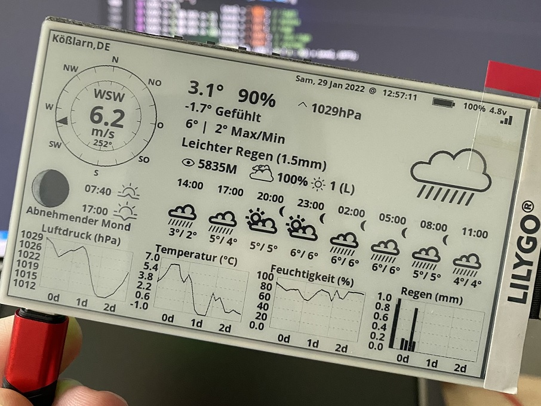

Weather Station and Mosquitto MQTT Values for LilyGO T5 4.7 inch e-paper display
=======================================

This project works with LilyGO T5 4.7 inch e-paper EPD display as available from [AliExpress](https://aliexpress.com/item/1005002272417292.html) and [OpenWeatherMap (OMW)](https://home.openweathermap.org) as ESP32 weather display.

## Compiling and flashing
Edit user_settings.h and enter OWM API key as well as the location for which you want to display the weather data.

To compile you will need following libraries  
- https://github.com/Xinyuan-LilyGO/LilyGo-EPD47
- https://github.com/bblanchon/ArduinoJson  

In board manager choose ESP32 Dev Module with PSRAM Enabled.  
The project is configured as PlatformIO oroject (Visual Studio Code AddIn) - to compile with arduino IDE rename src folder to OWM_EPD47.

## LilyGO T5 Display FAQ

- IO0 has been used and cannot be programmed.
- How to turn off the blue LED light?
    - To turn off the blue LED, you must call `epd_poweroff_all()`, which will turn off the entire power supply controlled by PWM_EN. Note that it cannot be turned off when powered by USB. It can only be turned off when powered by battery. For details, refer to `<examples/demo>`

# License

[GNU GENERAL PUBLIC LICENSE](./LICENSE)

## Remarks 
_(forked from [DzikuVx/LilyGo-EPD-4-7-OWM-Weather-Display](https://github.com/DzikuVx/LilyGo-EPD-4-7-OWM-Weather-Display))_  

The original code created by https://github.com/G6EJD/ is using the GPLv3 https://github.com/Xinyuan-LilyGO/LilyGo-EPD47 library to handle the display and as such falls into the GPLv3 license itself. This situation is described in the https://www.gnu.org/licenses/gpl-faq.html#IfLibraryIsGPL

> If a library is released under the GPL (not the LGPL), does that mean that any software which uses it has to be under the GPL or a GPL-compatible license?

> Yes, because the program actually links to the library. As such, the terms of the GPL apply to the entire combination. The software modules that link with the library may be under various GPL compatible licenses, but the work as a whole must be licensed under the GPL.

This means that the original proprietary license that G6EJD tried to enforce is unlawful as it is not compatible with the GPLv3 and removed from this fork, while keeping the attribution and all the copyright of the original creator.
